# LMS キャッチアッププロジェクト (Vue + Express + C++)

既存のNext.js + SupabaseベースのLMSを、Vue3 + Express + C++で再実装したプロジェクトです。

## システム構成図

```mermaid
graph TB
    subgraph "Frontend"
        Vue[Vue3 + TypeScript<br/>Composition API]
        Vite[Vite Dev Server<br/>:3000]
        Toast[Vue Toastification<br/>通知システム]
    end
    
    subgraph "Backend"
        Express[Express API<br/>:4000]
        Memory[(メモリDB<br/>Slots Data)]
        Conflict[Conflict Check<br/>API]
    end
    
    subgraph "Native Layer"
        CPP[C++ Addon<br/>analyzeSlot<br/>checkConflict]
    end
    
    subgraph "Testing"
        Cypress[Cypress E2E<br/>統合テスト]
    end
    
    Vue --> Vite
    Vue --> Toast
    Vite -->|API Request| Express
    Express --> Memory
    Express -->|Native Call| CPP
    Conflict --> CPP
    Cypress -->|Test| Vite
    Cypress -->|Test| Express
    
    style Vue fill:#4FC08D
    style Express fill:#FFA500
    style CPP fill:#00599C
    style Cypress fill:#17202C
```



### データフロー

1. **ユーザー操作** → Vue3 Component → Axios → Express API
2. **予約処理** → Express → C++ Addon (競合チェック) → Memory DB
3. **レスポンス** → Express → Vue3 → Toast通知 → UI更新

## 構成

- **Frontend**: Vue3 + Composition API + TypeScript + Vite
- **Backend**: Express + TypeScript (メモリ内データ管理)
- **C++ Addon**: Node.js addon (slotId分析機能)
- **E2E Test**: Cypress

## セットアップ

```bash
# 依存関係のインストール
pnpm install

# C++アドオンのビルド
pnpm --filter slot-analyzer build
```

## 開発サーバーの起動

```bash
# フロントエンドとバックエンドを同時起動
pnpm dev
```

- Frontend: http://localhost:3000
- Backend: http://localhost:4000

## 個別起動

```bash
# フロントエンドのみ
pnpm --filter frontend dev

# バックエンドのみ
pnpm --filter backend dev
```

## E2Eテスト

```bash
# 開発サーバーを起動した状態で実行
pnpm test:e2e
```

## プロジェクト構造

```
├── packages/
│   ├── frontend/     # Vue3アプリケーション
│   ├── backend/      # Express APIサーバー
│   └── addon/        # C++ Node.jsアドオン
├── e2e/              # Cypressテスト
└── package.json      # monorepoルート
```