# LMS キャッチアッププロジェクト (Vue + Express + C++)

[](https://github.com/kimny1143/catchup-20250618vue/actions/workflows/ci.yml)

既存のNext.js + SupabaseベースのLMSを、Vue3 + Express + C++で再実装したプロジェクトです。

## システム構成図

```mermaid
graph TB
    subgraph "Frontend"
        Vue[Vue3 + TypeScript<br/>Composition API]
        Vite[Vite Dev Server<br/>:3000]
        Toast[Vue Toastification<br/>通知システム]
    end
    
    subgraph "Backend"
        Express[Express API<br/>:4000]
        Memory[(メモリDB<br/>Slots Data<br/>→ Supabase予定)]
        Conflict[Conflict Check<br/>API]
        OpenAPI[OpenAPI/Swagger<br/>自動生成]
    end
    
    subgraph "Native Layer"
        CPP[C++ Addon<br/>analyzeSlot<br/>checkConflict]
    end
    
    subgraph "Testing"
        Cypress[Cypress E2E<br/>統合テスト]
    end
    
    Vue --> Vite
    Vue --> Toast
    Vite -->|API Request| Express
    Express --> Memory
    Express -->|Native Call| CPP
    Express --> OpenAPI
    Conflict --> CPP
    Cypress -->|Test| Vite
    Cypress -->|Test| Express
    
    style Vue fill:#4FC08D
    style Express fill:#FFA500
    style CPP fill:#00599C
    style Cypress fill:#17202C
```



### データフロー

1. **ユーザー操作** → Vue3 Component → Axios → Express API
2. **予約処理** → Express → C++ Addon (競合チェック) → Memory DB
3. **レスポンス** → Express → Vue3 → Toast通知 → UI更新

## 構成

- **Frontend**: Vue3 + Composition API + TypeScript + Vite
- **Backend**: Express + TypeScript (メモリ内データ管理)
- **C++ Addon**: Node.js addon (slotId分析機能)
- **E2E Test**: Cypress

## セットアップ

```bash
# 依存関係のインストール
pnpm install

# C++アドオンのビルド
pnpm --filter slot-analyzer build
```

## 開発サーバーの起動

```bash
# フロントエンドとバックエンドを同時起動
pnpm dev
```

- Frontend: http://localhost:3000
- Backend: http://localhost:4000
- API Documentation (Swagger): http://localhost:4000/api-docs
- OpenAPI Spec: http://localhost:4000/openapi.json

## 個別起動

```bash
# フロントエンドのみ
pnpm --filter frontend dev

# バックエンドのみ
pnpm --filter backend dev
```

## E2Eテスト

```bash
# 開発サーバーを起動した状態で実行
pnpm test:e2e
```

## プロジェクト構造

```
├── packages/
│   ├── frontend/     # Vue3アプリケーション
│   ├── backend/      # Express APIサーバー
│   ├── addon/        # C++ Node.jsアドオン
│   └── shared/       # 共通型定義
├── e2e/              # Cypressテスト
├── docs/             # ドキュメント
└── package.json      # monorepoルート
```

## API Quick Try

サーバー起動後、以下のコマンドでAPIを試せます：

```bash
# 全スロット取得
curl http://localhost:4000/api/slots

# 競合チェック（13:30は13:00の予約と競合）
curl -X POST http://localhost:4000/api/slots/check-conflict \
  -H "Content-Type: application/json" \
  -d '{"time": "2025-06-19 13:30"}'

# スロット予約（slot-001を予約）
curl -X POST http://localhost:4000/api/slots/slot-001/reserve

# 最適スロット提案
curl http://localhost:4000/api/slots/optimal

# OpenAPI仕様を取得
curl http://localhost:4000/openapi.json
```

ブラウザで http://localhost:4000/api-docs にアクセスすると、Swagger UIでインタラクティブにAPIを試せます。

## 主な機能

### 実装済み機能 ✅

1. **基本的な予約システム**
   - レッスンスロット一覧表示
   - スロット予約機能
   - 予約状態のリアルタイム反映

2. **高度な競合検出（C++実装）**
   - TimeInterval構造体による時間間隔管理
   - 重なりチェックと最小間隔チェック
   - 60分以内の予約競合を防ぐアルゴリズム
   - UTC時間処理とO(log n)最適化アルゴリズム

3. **APIドキュメント自動生成**
   - Zod + zod-to-openapi による型安全なスキーマ定義
   - Swagger UI でのインタラクティブなAPI探索
   - OpenAPI 3.0仕様準拠

4. **CI/CDパイプライン**
   - GitHub Actions による自動テスト
   - マルチバージョンNode.js対応（18.x, 20.x）
   - E2Eテスト自動実行

5. **ユーザー体験向上機能**
   - Vue Toastificationによる通知システム
   - ローカルキャッシュによるオフライン対応
   - エラーハンドリングとフィードバック
   - 楽観的UI更新でレスポンス向上

## 技術的特徴

- **モノレポアーキテクチャ**: pnpm workspacesによる効率的な依存関係管理
- **型安全性**: TypeScript + 共有型定義パッケージ + Zodスキーマ検証
- **パフォーマンス**: 
  - C++による計算処理の高速化
  - O(log n)アルゴリズムによる競合検索最適化
  - 楽観的UI更新によるレスポンス改善
- **品質保証**: 
  - Cypress E2Eテストによる統合テスト
  - Jest + Supertestによるユニットテスト
  - マルチOS対応CI（Ubuntu/macOS）
- **ドキュメント**: OpenAPI仕様による自動文書化
- **アーキテクチャ**: 
  - リポジトリパターンによる抽象化
  - メモリDBからSupabaseへの移行を想定した設計